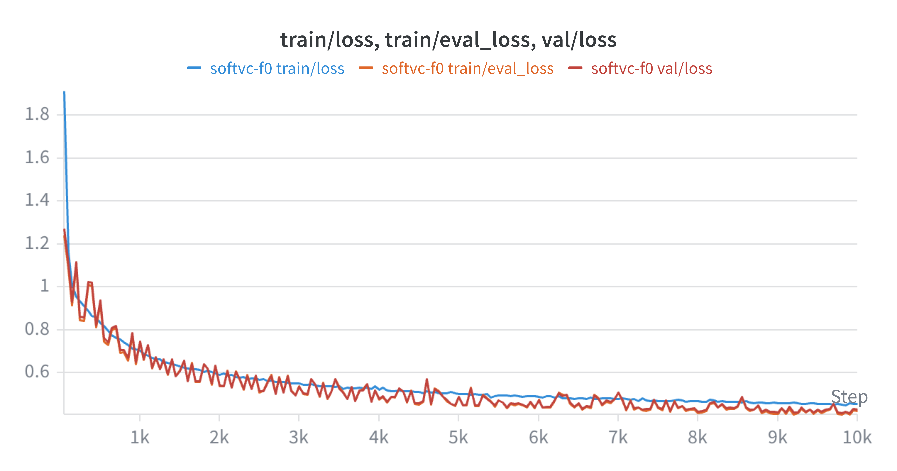

# Singing Voice Conversion

Stage 1 singing voice conversion baseline built around SoftVC-style acoustic modeling.

This repository extracts singing-specific acoustic features, trains a conditioned mel-prediction model, and synthesizes waveform audio with a pretrained HiFi-GAN vocoder. The current release focuses on a clean and reproducible Stage 1 baseline.

## Current Status

| Area | Status |
|---|---|
| Feature extraction | HuBERT-Soft content, RMVPE pitch, voiced flags, RMS volume, log-mel targets |
| Acoustic training | Stable Stage 1 mel prediction on M4Singer |
| Objective result | Best dev Mel L1: **0.3912** |
| Inference | End-to-end conversion works, but generated audio is not yet fully smooth |
| Next step | Diagnose where audio quality degrades before moving to Stage 2 |

## Overview

```text
source singing voice
  -> HuBERT-Soft content units
  -> RMVPE log-F0 + voiced flag
  -> RMS volume
  -> target speaker conditioning
  -> SoftVC-style acoustic model
  -> predicted mel
  -> pretrained HiFi-GAN
  -> converted waveform
```

This project does not reimplement HuBERT, RMVPE, or HiFi-GAN. The main contribution is the Stage 1 acoustic pipeline that extends SoftVC-style content conditioning with pitch, voicing, loudness, and speaker information:

```text
HuBERT-Soft content + log-F0 + voiced + RMS volume + speaker-id -> mel
```

Main model:

```text
src/svc/models/acoustic/softvc_f0.py
```

## Architecture

```text
Raw audio at 16 kHz
  -> content encoder
  -> pitch extractor
  -> volume extractor
  -> log-mel target
  -> JSONL manifests
```

```text
content + log-F0 + voiced + volume + speaker-id
  -> ConditioningFusion
  -> SoftVC encoder
  -> autoregressive LSTM decoder
  -> mel
  -> HiFi-GAN
```

## Results

Stage 1 was trained on M4Singer with 20 speakers. Reported losses are teacher-forced mel prediction losses, which are useful for comparing checkpoints but do not fully predict free-running audio quality.

| Item | Value |
|---|---|
| Sample rate | 16 kHz |
| Mel target | 128-bin log-mel |
| Parameters | 19.1M |
| Optimizer | AdamW |
| Loss | masked length-normalized Mel L1 |
| Best checkpoint | `checkpoints/softvc_f0_best.pt` |
| Final reported step | 17,600 |

### Learning Curve



`train/eval_loss` and `val/loss` are computed in evaluation mode with teacher forcing and the same masked Mel L1 objective. They are the most useful curves for checkpoint comparison.

### Checkpoints

| Step | Train loss | Train eval loss | Val loss |
|---:|---:|---:|---:|
| 1,000 | 0.7021 | 0.7451 | 0.7474 |
| 2,000 | 0.5928 | 0.5396 | 0.5406 |
| 5,000 | 0.5023 | 0.4879 | 0.4881 |
| 10,000 | 0.4555 | 0.4220 | 0.4293 |
| 15,000 | 0.4271 | 0.4118 | 0.4154 |
| 16,550 | 0.4267 | 0.3784 | **0.3912** |
| 17,600 | 0.4271 | 0.3900 | 0.4010 |

Objective evaluation:

| Checkpoint | Split | Clips | Mel L1 |
|---|---|---:|---:|
| `softvc_f0_best.pt` | dev | full validation pass | **0.3912** |
| `softvc_f0_best.pt` | dev | 64 clips, CLI evaluation | 0.3786 |
| `softvc_f0_step_17600.pt` | dev | full validation pass | 0.4010 |

The best checkpoint is selected by validation Mel L1. Audio quality is evaluated separately by listening to generated samples.

### Audio Samples

Generated samples are written to `outputs/inference/`; original source clips are copied to `outputs/original/`.

| Source | Target speaker | Checkpoint | Original | Converted |
|---|---|---|---|---|
| `test/Alto-7/远走高飞/0010.wav` | `Soprano-1` | `softvc_f0_best.pt` | [`0010.wav`](outputs/original/0010.wav) | [`0010_spk10_softvc_f0_best.wav`](outputs/inference/0010_spk10_softvc_f0_best.wav) |
| `test/Alto-7/远走高飞/0010.wav` | `Alto-4` | `softvc_f0_best.pt` | [`0010.wav`](outputs/original/0010.wav) | [`0010_spk3_softvc_f0_best.wav`](outputs/inference/0010_spk3_softvc_f0_best.wav) |

These are Stage 1 baseline outputs. The mel prediction objective is stable, but the converted audio is not yet fully smooth. The main suspected issue is the gap between teacher-forced training and free-running autoregressive inference.

## Quickstart

Create an environment:

```bash
python3.11 -m venv .venv
source .venv/bin/activate
python -m pip install --upgrade pip
```

Install on Apple Silicon:

```bash
python -m pip install -e '.[rmvpe,tracking]'
```

Install on Colab/Linux CUDA:

```bash
python -m pip install -e ".[rmvpe-cuda,tracking]"
python -m pip install --no-deps "rmvpe-onnx==0.2.3"
```

Without Weights & Biases:

```bash
python -m pip install -e '.[rmvpe]'
```

## Data

Expected raw layout:

```text
data/raw/m4singer/
  train/<speaker>/<song>/*.wav
  dev/<speaker>/<song>/*.wav
  test/<speaker>/<song>/*.wav
```

The M4Singer preparation script splits by song, not by segment. This prevents fragments of the same song from appearing in multiple splits. Speakers that appear in `dev` or `test` are also kept present in `train`, so evaluation uses known speaker identities with held-out songs.

Prepare M4Singer:

```bash
python scripts/prepare_m4singer_dataset.py \
  --config configs/dataset/m4singer.yaml
```

## Preprocess

Warm model caches before multiprocessing:

```bash
python -m svc.cli.cache \
  --config configs/prepare/manifest.yaml
```

Build features and manifests:

```bash
python -m svc.cli.prepare \
  --config configs/prepare/manifest.yaml
```

Outputs:

```text
data/processed/
data/manifests/manifest_train.jsonl
data/manifests/manifest_dev.jsonl
data/manifests/manifest_test.jsonl
```

## Train

```bash
python -m svc.cli.train \
  --config configs/train/softvc_f0.yaml
```

Short smoke test:

```bash
python -m svc.cli.train \
  --config configs/train/softvc_f0.yaml \
  --max-steps 1000
```

## Evaluate

```bash
python -m svc.cli.evaluate \
  --config configs/train/softvc_f0.yaml \
  --checkpoint checkpoints/softvc_f0_best.pt \
  --split dev \
  --num-clips 64
```

## Convert

Convert with a target speaker name:

```bash
python -m svc.cli.convert \
  --config configs/inference/softvc_f0.yaml \
  --checkpoint checkpoints/softvc_f0_best.pt \
  --input data/raw/m4singer/test/Alto-7/远走高飞/0010.wav \
  --speaker Soprano-1
```

Convert with a target speaker id:

```bash
python -m svc.cli.convert \
  --config configs/inference/softvc_f0.yaml \
  --checkpoint checkpoints/softvc_f0_best.pt \
  --input path/to/input.wav \
  --speaker-id 10
```

If `--speaker` and `--speaker-id` are omitted, the CLI prints the available target singers and asks for a choice. Speaker ids are defined in:

```text
data/processed/speaker_map.json
```

## Project Layout

```text
configs/        dataset, preprocessing, training, and inference configs
scripts/        dataset preparation helpers
src/svc/cli/    command-line entry points
src/svc/data/   manifests, datasets, preprocessing
src/svc/features/
                content, pitch, mel, and volume extraction
src/svc/models/ acoustic model and vocoder wrappers
src/svc/training/
                trainer, losses, and experiment logging
src/svc/inference/
                conversion pipeline
src/svc/evaluation/
                checkpoint evaluation
src/svc/utils/  config, device, seed, and runtime helpers
```

## Limitations

- Stage 1 is a baseline, not a production-quality conversion model yet.
- The generated audio currently lacks fluidity, even though the teacher-forced mel objective is stable.
- Training uses teacher forcing, while inference is fully autoregressive; errors can accumulate during generation.
- The HiFi-GAN vocoder is pretrained and not fine-tuned on predicted mels.

## Next Step

Before moving to Stage 2, the next step is a focused Stage 1 diagnostic. The goal is to locate where the audio degradation appears by comparing:

```text
original waveform
target mel -> HiFi-GAN
teacher-forced predicted mel -> HiFi-GAN
autoregressive generated mel -> HiFi-GAN
```

This should identify whether the issue comes from the vocoder, the acoustic model, or the autoregressive inference loop. After this diagnosis, the likely fixes are scheduled sampling, a revised decoder, a non-autoregressive acoustic model, or a pitch-aware vocoder such as NSF-HiFi-GAN.

## References

Implementation is aligned in spirit with:

- `bshall/acoustic-model` for the SoftVC decoder and upsample recipe.
- `bshall/hubert` for content units.
- RMVPE for pitch extraction.
- `bshall/hifigan` for vocoding.

Bibliography:

- van Niekerk et al. A Comparison of Discrete and Soft Speech Units for Improved Voice Conversion. ICASSP 2022.
- Hsu et al. HuBERT: Self-Supervised Speech Representation Learning by Masked Prediction of Hidden Units. TASLP 2021.
- Qian et al. ContentVec: An Improved Self-Supervised Speech Representation by Disentangling Speakers. ICML 2022.
- Babu et al. XLS-R: Self-supervised Cross-lingual Speech Representation Learning at Scale. Interspeech 2022.
- Pratap et al. Scaling Speech Technology to 1,000+ Languages. arXiv 2023.
- Wei et al. RMVPE: A Robust Model for Vocal Pitch Estimation in Polyphonic Music. Interspeech 2023.
- Kong et al. HiFi-GAN: Generative Adversarial Networks for Efficient and High Fidelity Speech Synthesis. NeurIPS 2020.
- Wang et al. Neural Source-Filter-Based Waveform Model for Statistical Parametric Speech Synthesis. ICASSP 2019.
- Yamamoto et al. Parallel WaveGAN. ICASSP 2020.
